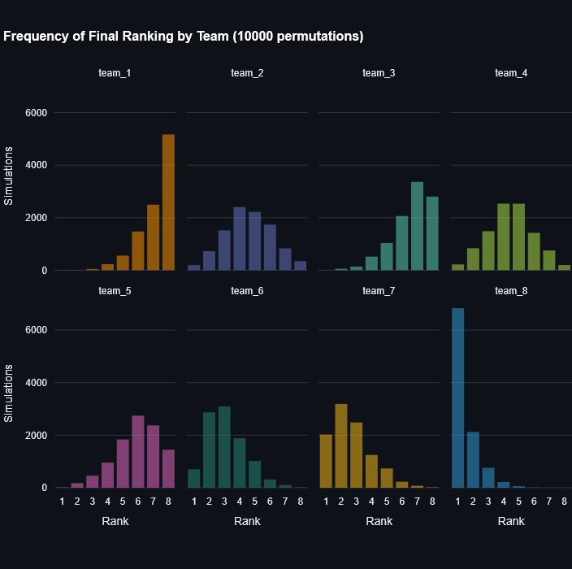

# Fantacalcio League Simulator

Nel Fantacalcio non sempre vince il più bravo. Anche quest'anno è andata così? Scopri se il vincitore è stato davvero il più bravo o se deve tutto al fattore C...

Questo progetto ti permette di analizzare a posteriori un campionato di Fantacalcio simulando migliaia di possibili calendari casuali: potrai così confrontare il risultato reale con quelli alternativi e capire quanto abbia influito la fortuna.

Scarica il calendario (.xlsx) da Fantagazzetta, converti il file in CSV e salvalo nella cartella `input/`, poi esegui gli script in ordine per simulare 10.000 campionati casuali e scoprire quanto il calendario ha influenzato le sorti del campionato.

1. Avvia `01_process_calendar.py` e seleziona il file CSV del calendario per pulire e organizzare i dati creando un nuovo file CSV pronto per le simulazioni.
2. Avvia `02_league_simulator.py` e scegli il file generato per simulare 10000 campionati con giornate casuali e salvare i risultati in un nuovo file.
3. Lancia la dashboard con `streamlit run 03_app.py` per visualizzare i risultati delle simulazioni con un grafico interattivo.



```
fantacalcio_simulations/
├── input/
    └── your_league_calendar.csv
├── output/
    ├── processed_calendar.csv
    └── simulation_results.csv
├── scripts/
│   ├── 01_load_calendar.py
│   ├── 02_league_simulations.py
│   └── 03_app.py
└── README.md
```